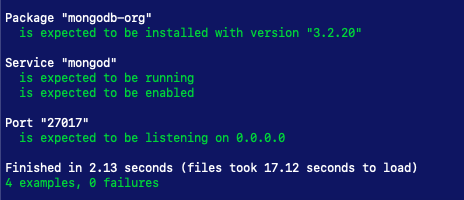
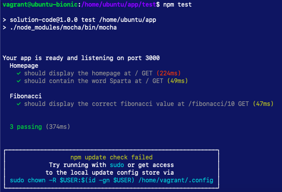
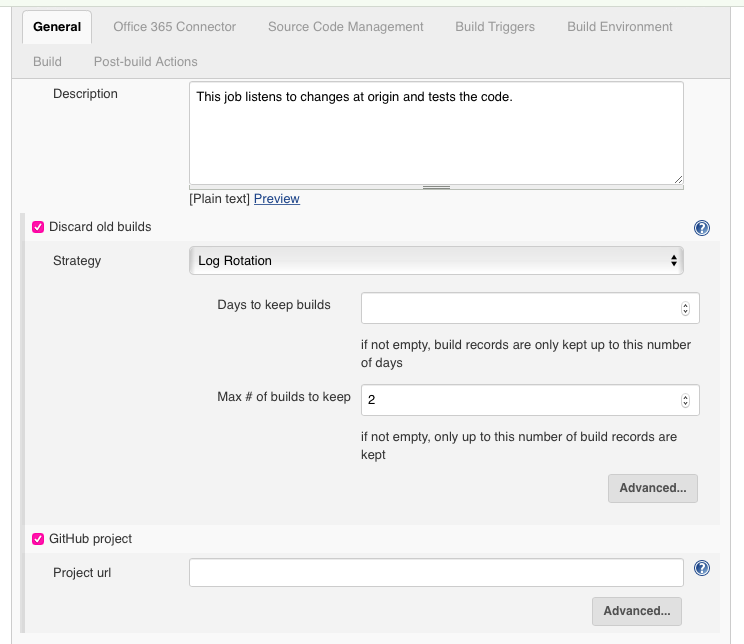
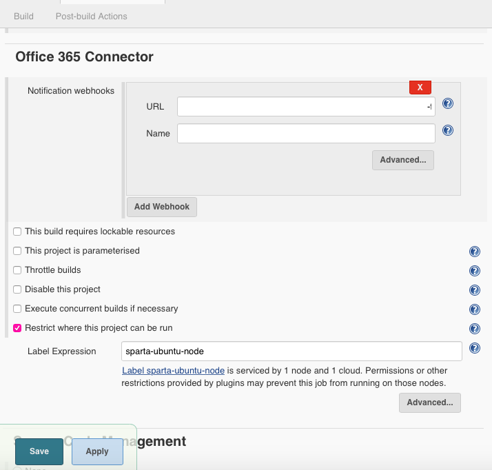
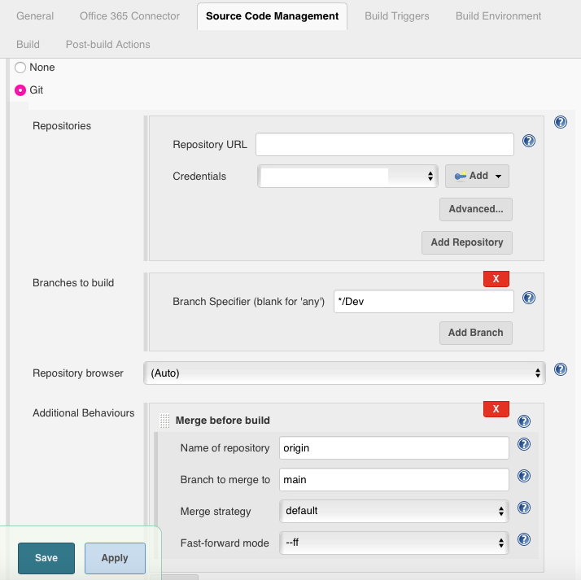
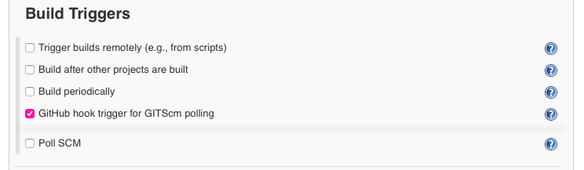
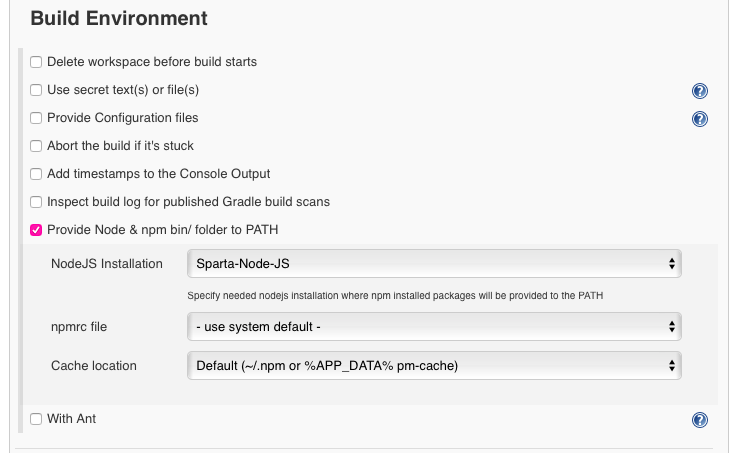
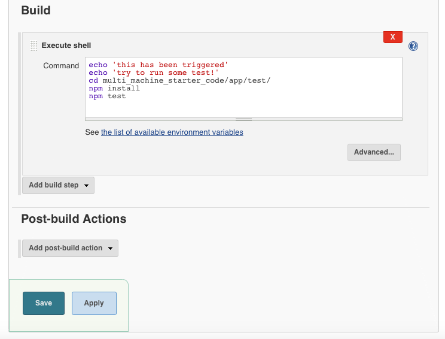
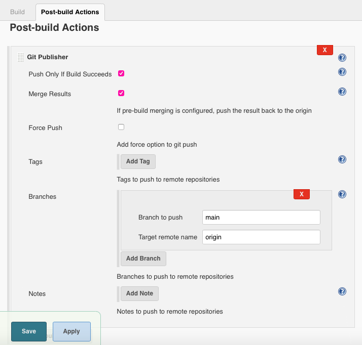
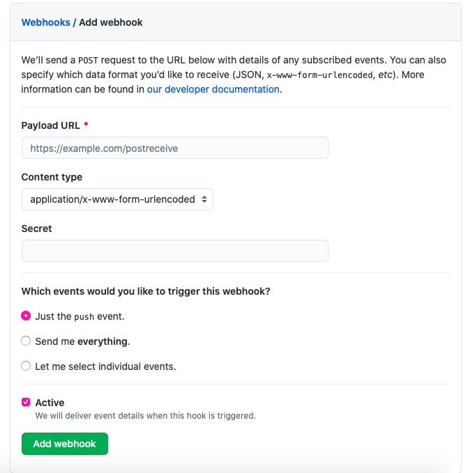

# Sparta Node Sample App with CI

## Introduction
This documents the process of creating a CI pipeline for a Sparta sample node app.

## Pre-Requisites
1. Vagrant
2. Ruby
3. Bundler
4. Virtual Box
5. Git
6. Jenkins

## Instructions
1. Clone this repo
2. Run `vagrant up`
3. Go to `development.local` or `192.168.10.100`

### Running local tests
1. Run `vagrant up app` and `vagrant up db`
2. In a separate terminal window, navigate to the tests directory `cd tests/`
3. Run `rake spec`       
  


4. Vagrant ssh into the App
5. Navigate to the app directory `cd /home/ubuntu/app`
6. Stop the app from running as this will prevent the tests from passing. `pm2 stop app.js`
6. Run `npm test`    
  


### Jenkins CI
1. Navigate to Jenkins
2. Login, create a user if necessary
3. Create a 'new item' and click 'Freestyle Project'.
4. Proceed to configure the file.
#### Configuration
* **General**
    * Write a description (optional)
    * Check the box marked 'discard old builds' and set the 'max # of build to keep' to an appropriate value e.g. 2
    * Check the box marked 'GitHub project' and paste the url of your GitHub repository.
    
  * **Office 365 Connector**
    * Check the box marked 'restrict where this project can be run' and type 'sparta-ubuntu-node' (N.B. Begin typing and this should show in the drop down. It may require re-selecting to get rid of errors.)
    * Send notifications to Teams via the 'Add a Webhook tab'. The URL can be found by navigating to Microsoft Teams and clicking the options(...) for the channel you wish to send notifications to. From the drop-down, select 'connectors' and then 'Jenkins'. Copy the URL link and paste on Jenkins. The name can be any descriptive name. Select the notifications you wish to receive i.e. successes, failures etc.
    
  * **Source Code Management**    
    * Check the box marked 'Git'          
    * In 'Repository URL' add the ssh key of the repository you wish to link. This can be accessed via clicking 'code' on the home page of the repository. Select ssh and copy the key. This will throw an error. Proceed to 'Credentials'
    * Click the 'Add' button beside 'Credentials'. This will enable you to add an authentication key. If this has not been created, refer back to the generic [configuration](https://github.com/A-Ahmed100216/jenkins_intro/blob/main/jenkins.md)
    * Change the 'Branch Specifier' to '*/Dev' as this will read any changes to the Dev branch.
    * Click the 'add' button beside 'Additional Behaviours' and select 'Merge before build' from the drop down. Set the 'Name of Repository' as 'origin' and the 'Branch to merge to' as main.     
        
  * **Build Triggers**
    * Check the box for 'GitHub hook tigger for GITScm polling'
    
  * **Build Environment**
    * Check the box for 'Provide Node & npm bin/ folder to PATH'
    
  * **Build**
    * Check 'Execute shell' and add the following commands to execute the test file.
    ```bash
    echo 'this has been triggered'
    echo 'try to run some test!'
    # Go to location of test file
    cd multi_machine_starter_code/app/test/
    # Install npm
    npm install
    # Run tests
    npm test
    ```       
    
  * **Post-Build Actions**
    * Click 'Add Post-Build action' and select 'Git Publisher' from the drop-down menu.
    * Check the boxes marked 'Push Only If Build Succeeds' and 'Merge Results.'
    * Set 'Branch to Push' as 'main' and 'Target remote name' as 'origin'.   
    * Add another action 'set GitHub commit status'. Leave as default
    
  * Save changes
5. Create a webhook. Go to the repository settings on GitHub. Click 'Webhooks' and 'Add Webhook'. Under 'Payload URL' add http://ip:8080/github-webhook/ where ip depends on the jenkins ip address. Change 'Content type' to 'application/json' and select 'Send me everything' for trigger events. Save.      
    
6. Execute a build by making a change to the code. Ensure the working branch is the Dev branch. This can be checked by running `git branch`.
7. Introduce a failure to ensure the changes are not merged. This can be done by changing one of the tests.


## Testing merges
* Test 1 - Configured file to listen to the Dev branch. A notification was sent to Microsoft Teams as shown in the image below.


* Test 2 - A small change was made to test to check if failures are not merged. As shown in the image below, changes were not pushed to main.     
      
Likewise the notification sent to Teams notified a failure.   

* Test 3 - Reverted back to tests passing which led to successful merges and a successful build notification on Teams.      
    
* Test 4 - Checking pipeline integration
